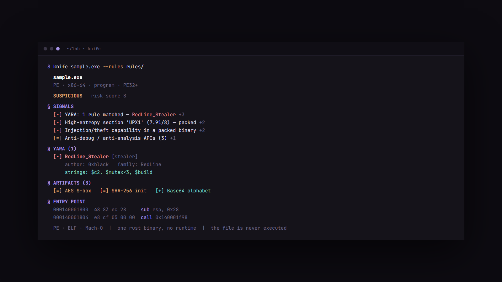

<div align="center">

# knife

**A reverse engineer's binary Swiss-army knife, in Rust.**

Parse, triage, and disassemble **PE, ELF, and Mach-O** from one small binary.
No runtime, no services, the target is never executed.

[](https://github.com/bl4ckr0ss3/knife/actions/workflows/ci.yml)
[](https://crates.io/crates/reknife)
[](LICENSE)




</div>

## Why

Pulling apart an unknown binary usually means five tools: one for the headers,
one for strings and IOCs, one for imports, one for entropy, one to disassemble.
`knife` is all of them in a single command, across three formats, with a
transparent triage verdict on top. Everything is static: it reads the bytes on
disk and never runs the file.

## Install

```bash
# from crates.io (installs the `knife` command)
cargo install reknife

# prebuilt binary, no toolchain needed (cargo-binstall)
cargo binstall reknife

# latest from git
cargo install --git https://github.com/bl4ckr0ss3/knife
```

Or grab a prebuilt archive for Linux, macOS, or Windows from the
[Releases](https://github.com/bl4ckr0ss3/knife/releases) page and drop `knife`
on your `PATH`.

## Commands

One tool, many jobs, which is the point of a Swiss-army knife:

| command | what you get |
|---|---|
| `knife FILE` | full triage: verdict, hashes, sections, capabilities, IOCs, artifacts, entry disasm |
| `knife funcs FILE [--by-refs]` | recover functions via control-flow analysis |
| `knife dis FILE --func NAME` | disassemble a whole function with labels and xrefs |
| `knife dis FILE [--vaddr X \| --off Y] [--count N]` | linear disassembly (x86/x64) |
| `knife sections FILE` | sections/segments with per-section entropy bars |
| `knife imports FILE` | imported libs and functions, suspicious APIs flagged |
| `knife exports FILE` | exported symbols |
| `knife caps FILE` | capabilities inferred from the symbol surface |
| `knife strings FILE --min N` | ASCII and UTF-16 strings |
| `knife iocs FILE` | URLs, IPs, domains, emails, wallets, reg keys, paths, defanged |
| `knife hashes FILE` | MD5 / SHA-1 / SHA-256 and imphash |
| `knife scan FILE` | crypto constants, packer markers, embedded formats |
| `knife yara RULES FILE` | match YARA rules (RULES is a file or a directory) |
| `knife map FILE` | whole-file entropy sparkline, packed regions flagged |
| `knife hex FILE --off O --len L` | hex dump |
| `knife ls FILE` | archive (.a/.lib) members |

Add `--json` to any analysis command for machine-readable output. `knife FILE`
is shorthand for `knife info FILE`, and `knife FILE --rules DIR` folds a YARA
pass into the verdict.

## What makes it more than objdump

**Cross-format, one model.** [goblin](https://github.com/m4b/goblin) parses
PE/ELF/Mach-O into a single neutral model, so every command works on every
format. Validated on a signed Windows DLL, a stripped RISC-V ELF, and a macOS
x86-64 Mach-O.

**A real analysis engine.** `knife funcs` runs recursive-descent disassembly
seeded from the entry point and every named symbol, follows calls and branches,
splits basic blocks, builds a control-flow graph, and counts cross-references.
`knife dis --func` prints a whole function with `loc_` labels, resolved call
targets, and xrefs-to. On `kernel32.dll` it recovers 2174 functions, 1430 of
them named. Everything is in virtual-address space, so the address column,
branch operands, and symbol names all agree.

**Constant scanning.** `knife scan` fingerprints crypto and structure by their
byte signatures: AES S-boxes (generated from the GF(2⁸) definition, not stored
as literals), SHA-1/256/MD5/CRC32 constants in both byte orders, Base64
alphabets, packer markers, and embedded formats (zip, 7z, gzip, PNG, PDF, CLR
metadata). Embedded PEs are confirmed by walking the DOS to PE header chain.

**YARA built in.** `knife yara` runs rules through
[yara-x](https://github.com/VirusTotal/yara-x), VirusTotal's pure-Rust engine,
so there is no libyara C dependency. Matches can feed the triage verdict.

**Transparent triage.** The verdict (`CLEAN` / `LOW RISK` / `SUSPICIOUS` /
`MALICIOUS`) is an additive score where every point is a named signal you can
read. It weights concealment and anomaly (packing, RWX sections, high-entropy
overlays, tiny import tables) above raw capability, because a system DLL
legitimately exports powerful APIs. It shows what a binary can do and how it is
built, and leaves intent to you.

## Examples

```bash
# triage a sample and fold a rule directory into the verdict
knife sample.exe --rules ~/rules/

# busiest functions, then read the hot one
knife funcs sample.exe --by-refs
knife dis sample.exe --func sub_401240

# what crypto is this stripped blob doing?
knife scan blob.bin

# pull defanged network indicators as JSON
knife iocs sample.exe --json | jq '.[] | select(.kind=="url").value'
```

## Roadmap

- [x] Multi-format parsing (PE / ELF / Mach-O)
- [x] Static triage with a transparent verdict
- [x] Strings, IOCs, imphash, entropy map
- [x] Crypto/packer/embedded constant scanner
- [x] YARA (yara-x) matching
- [x] Analysis engine: functions, CFG, xrefs
- [ ] IAT import-name resolution in disassembly
- [ ] Interactive TUI (function list / disasm / hex / xrefs)
- [ ] Library-function identification (FLIRT-style)
- [ ] IR lift toward a decompiler view

## Build from source

```bash
cargo build --release        # target/release/knife
cargo test
```

Needs a recent stable Rust (2021 edition). No system libraries beyond the
platform default; the YARA engine is pure Rust.

## Contributing

Issues and pull requests are welcome. Please run `cargo fmt`, `cargo clippy`,
and `cargo test` before opening a PR; CI enforces all three across Linux,
macOS, and Windows. See [CONTRIBUTING.md](CONTRIBUTING.md).

## License

MIT. See [LICENSE](LICENSE).
